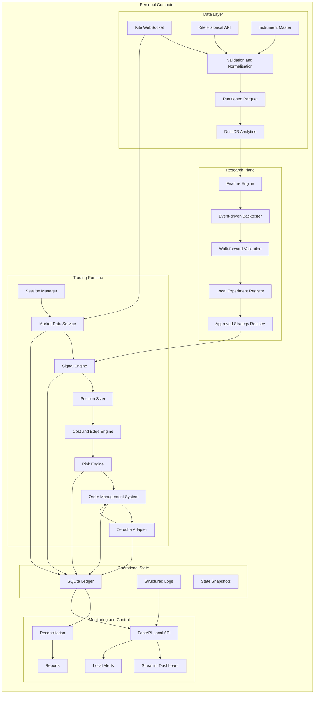

# Personal Quant Trading System
## Local-First Engineering Blueprint and Codex Implementation Specification

**Version:** 0.1  
**Prepared for:** Piyush Chandra  
**Prepared on:** 27 July 2026  
**Initial capital:** ₹10,000  
**Broker:** Zerodha through Kite Connect  
**Initial deployment:** One personal computer, no cloud compute or hosted services  
**Primary objective:** Build a safe, auditable personal trading system with a credible path to positive **operating net profit after all trading, API, connectivity, and infrastructure costs**.

> **Important:** This document is an engineering specification, not a promise of returns or financial advice. Trading can lose capital. Live deployment must remain gated behind the controls and acceptance criteria defined here.

---

# 1. How to use this document with Codex

Treat this file as the product requirements document, architecture specification, and implementation contract.

When asking Codex to work on the repository:

1. Supply this file and the current repository tree.
2. Ask it to implement only one work package at a time.
3. Require it to show:
   - files added or changed;
   - assumptions;
   - design decisions;
   - commands to run;
   - tests added;
   - test results;
   - known limitations;
   - any deviation from this specification.
4. Do not allow Codex to connect to production order endpoints until all paper and shadow-mode gates are passed.
5. Never provide real API secrets, access tokens, passwords, TOTP seeds, demat PINs, or personal account details in a prompt.
6. Require mock broker adapters and recorded fixtures for automated tests.
7. Require human review before merging changes that can:
   - place, modify, or cancel an order;
   - alter risk limits;
   - enable live mode;
   - alter P&L or charge calculations;
   - alter authentication or secrets handling;
   - alter reconciliation logic.
8. Prefer small, testable changes. One pull request should generally implement one component or one coherent vertical slice.
9. Record intentional architecture changes as Architecture Decision Records under `docs/adr/`.
10. Do not let the coding agent silently replace a conservative requirement with a more convenient implementation.

## 1.1 Suggested Codex prompt

```text
Implement Work Package <ID> from PERSONAL_QUANT_SYSTEM_BLUEPRINT.md.

Rules:
- Implement only this work package and its explicit prerequisites.
- Preserve the modular-monolith architecture.
- Do not add cloud services, Docker, Kafka, Redis, PostgreSQL, Spark, Airflow, or Kubernetes.
- Do not activate real order placement.
- Use Python 3.12, type hints, Pydantic models, structured errors, and tests.
- Do not hard-code secrets, charges, market holidays, instrument tokens, or risk limits.
- Use Decimal for monetary ledger calculations.
- Use an injected clock. Production logic must not call datetime.now() directly.
- Use idempotent event handling.
- Add unit and integration tests appropriate to the package.
- Show the changed file tree, commands, test output, assumptions, and unfinished work.
- Stop and report the issue if an implementation would weaken a hard risk gate.
```

## 1.2 Definition of done for every work package

A package is complete only when:

- code is typed and linted;
- unit tests pass;
- relevant integration tests pass;
- configuration is documented;
- failure cases are handled;
- logs do not leak secrets;
- public interfaces are documented;
- no live order can be placed accidentally;
- the README or relevant runbook is updated;
- the package acceptance criteria in this document are met.

---

# 2. Executive summary

The project will be a **local modular monolith**. Research, backtesting, replay, paper trading, live execution, accounting, monitoring, and reporting share common domain models, but remain cleanly separated by interfaces.

The project will initially target:

- liquid NSE cash equities or ETFs;
- long-only positions;
- low or medium turnover;
- one open position at a time;
- daily or intraday-bar decision frequencies;
- no leverage;
- no short selling;
- no options or futures;
- no HFT claims;
- no cloud runtime.

The system is not considered successful because a backtest is profitable. It must distinguish:

1. **Gross P&L**  
   Price profit before costs.

2. **Trading net P&L**  
   Gross P&L after brokerage, taxes, statutory charges, DP charges, spread, slippage, and impact assumptions.

3. **Operating net P&L**  
   Trading net P&L after API subscription, static-IP cost, connectivity, storage, and other operating expenses.

The architecture prioritises:

- capital preservation before growth;
- correctness before speed;
- auditability before automation;
- realistic costs before attractive charts;
- paper validation before live orders;
- low fixed cost before infrastructure sophistication;
- one controlled strategy before a crowded strategy zoo.

---

# 3. Current Zerodha integration constraints

The following assumptions were verified against official Zerodha and Kite Connect material on 27 July 2026. Re-check them before a live release.

## 3.1 Static public IP for order requests

Zerodha states that all Kite Connect API order requests from an unregistered IP are rejected. This applies to API order placement regardless of frequency. Only order endpoints are IP-validated; WebSocket data, positions, order-book reads, and other non-order endpoints remain accessible from other IPs.

**Engineering implications:**

- backtesting, replay, paper trading, and read-only shadow mode can be developed before obtaining a static IP;
- live order placement remains disabled until the current public IP is registered and verified;
- the live pre-flight must compare the current public IP with the expected registered value;
- a dynamic broadband reconnection, hotspot, or failover connection can invalidate live execution;
- do not attempt to evade the control through rotating VPNs or hidden proxy paths;
- the cost of a static IP must be included in operating net P&L.

Official reference:  
https://kite.trade/forum/discussion/15912/preparing-to-comply-with-sebis-retail-algo-rules-static-ip-ratelimits-order-types

## 3.2 Market protection for API market orders

Zerodha's 2026 retail-algo guidance states that API market orders require market protection and that a zero protection value is rejected, including SL-M orders.

**V1 decision:** do not use market or SL-M orders. Use controlled LIMIT orders until market-protection behaviour has been explicitly implemented and tested.

## 3.3 Authentication and token expiry

The access token is obtained through the browser login and request-token exchange. Unless invalidated earlier, it expires at 6:00 AM on the following day.

**Engineering implications:**

- daily human login is expected;
- no browser credential automation;
- no long-lived token assumption;
- the session manager must validate the returned account identity;
- token expiry or master logout must stop new orders safely.

Official reference:  
https://kite.trade/docs/connect/v3/user/

## 3.4 API plans and fixed cost

The current Personal plan is free and includes order, portfolio, margin, GTT, and alert functions, but excludes real-time and historical data. The Connect plan costs ₹500 per app per month and includes WebSocket real-time data and historical candles.

**Engineering implications:**

- capability detection must be configuration-driven;
- ₹500 is a fixed operating cost when the paid plan is active;
- the monthly break-even report must allocate the complete subscription cost;
- the project can use the official sandbox and local fixtures before paying for production data.

Official reference:  
https://support.zerodha.com/category/trading-and-markets/general-kite/kite-api/articles/what-are-the-charges-for-kite-apis

## 3.5 API limits

Current documented limits include:

- quote endpoint: 1 request per second;
- historical candles: 3 requests per second;
- order placement: 10 requests per second;
- other endpoints: 10 requests per second;
- 400 orders per minute;
- 5,000 orders per day;
- maximum 25 modifications per order.

**V1 internal limits must be far lower**, for example no more than 10 total order requests per day and no more than two modifications per order.

Official reference:  
https://kite.trade/docs/connect/v3/exceptions/

## 3.6 Instrument master

The instrument dump is generated once daily. Zerodha recommends downloading it once a day and storing it locally. Instruments should be addressed durably by exchange and trading symbol, not only numeric token.

Official reference:  
https://kite.trade/docs/connect/v3/market-data-and-instruments/

## 3.7 Sandbox

Kite Connect provides a sandbox with demo credentials and no real money. It supports authentication, market data, order flows, portfolio flows, and production-like rate limits for supported routes.

**V1 decision:** broker integration must pass sandbox and local mock tests before production account use.

Official reference:  
https://kite.trade/docs/connect/v3/sandbox/

## 3.8 Rules and charges can change

Broker rules, exchange rules, tax rates, DP charges, order types, and market timings can change. Every external rule or charge must be:

- configuration-driven;
- tagged with `verified_on`;
- linked to an official source;
- reviewed before live release;
- versioned so historical P&L can be reproduced.

---

# 4. Product goals

## 4.1 Primary goal

Build a local personal quant platform that can identify, validate, execute, account for, and monitor a strategy with a credible path to positive operating net profit after all costs.

## 4.2 Engineering goals

The system shall:

- ingest and validate historical and live data;
- maintain immutable raw data and curated datasets;
- run deterministic, reproducible backtests;
- model realistic transaction costs and execution uncertainty;
- support historical replay;
- support live-data paper trading;
- support read-only shadow mode;
- enforce independent pre-trade risk controls;
- place real orders only through an approved broker adapter;
- reconcile broker state with local state;
- keep an append-only audit trail;
- expose local monitoring and control interfaces;
- recover safely after restart, disconnect, or ambiguous API response;
- produce daily, weekly, and monthly reports;
- trace every trade to strategy, data, feature, signal, cost, and risk versions.

## 4.3 Research goals

The research platform shall:

- avoid look-ahead bias;
- avoid survivorship bias where relevant;
- use train, validation, and untouched test periods;
- support walk-forward analysis;
- test sensitivity to parameters and costs;
- compare with simple baselines;
- record unsuccessful experiments;
- estimate turnover, capital utilisation, and capacity;
- use the same core strategy logic in backtest and runtime.

## 4.4 Financial goals

The system shall calculate:

- gross realised and unrealised P&L;
- variable trading costs;
- recurring fixed costs;
- break-even return;
- return on starting capital;
- return on average deployed capital;
- cost-to-gross-profit ratio;
- P&L by strategy, symbol, day, week, and month;
- maximum drawdown and drawdown duration;
- capital deposits and withdrawals separately from returns.

## 4.5 Safety goals

The system shall:

- default to paper mode;
- require deliberate live activation;
- require current authentication;
- require static-IP verification for live order calls;
- reject stale or inconsistent market data;
- reject duplicate order intents;
- cap exposure, order count, and daily loss;
- include persistent manual and automatic kill switches;
- stop after unresolved reconciliation differences;
- preserve evidence needed to reconstruct every decision.

---

# 5. Non-goals for Version 1

Version 1 will not provide:

- HFT or latency arbitrage;
- colocation or direct market access;
- multi-broker routing;
- options or futures trading;
- leverage or margin funding;
- short selling;
- automated fund management for other people;
- public software-as-a-service;
- mobile application;
- generative-AI-controlled orders;
- autonomous risk-limit changes;
- self-modifying live strategies;
- automated browser login;
- distributed compute;
- paid cloud deployment;
- Kafka, Redis, Airflow, Spark, PostgreSQL, or Kubernetes;
- GPU modelling;
- guaranteed monthly profit.

These items may be reconsidered only when the local system is reliable and the economics justify the complexity.

---

# 6. Success criteria

## 6.1 Platform success

The platform is technically successful after:

- 30 consecutive market sessions in paper mode;
- no unexplained order;
- no unexplained position;
- daily reconciliation passes;
- duplicate events do not alter state twice;
- all expected reports are produced;
- restart and disconnect recovery tests pass;
- kill switch is tested;
- every order intent is traceable to its complete decision chain.

## 6.2 Strategy research success

A strategy is research-viable when:

- out-of-sample trading net P&L is positive;
- it remains positive under 1.5x expected variable costs;
- a 2.0x cost scenario is reported;
- results do not depend on one symbol, month, or extraordinary event;
- modest parameter changes do not destroy performance;
- drawdown fits the declared risk appetite;
- it beats a relevant simple baseline after costs;
- an economic or behavioural rationale is documented;
- replay and paper results show acceptable degradation.

## 6.3 Paper-to-live success

A strategy may enter a tiny live pilot only after:

- sandbox tests pass;
- paper runtime is stable for 30 sessions;
- shadow mode passes;
- static-IP registration is verified;
- actual broker-account identity is checked;
- all hard risk gates pass;
- backtest, replay, and paper artefacts are archived;
- a human signs the live release checklist.

## 6.4 Operating-profit success

The full project is economically successful only when, over a meaningful multi-month period:

```text
Operating net P&L
= gross trading P&L
- variable transaction costs
- spread and slippage
- DP charges
- API subscription
- static-IP cost
- other operating costs
> 0
```

A single positive week or month is not sufficient evidence.

---

# 7. Recommended local technology stack

| Concern | Technology | Use |
|---|---|---|
| Host | Windows 11 with WSL2 Ubuntu, or native Ubuntu | Stable local runtime |
| Language | Python 3.12 | Research and execution |
| Package manager | `uv` | Virtual environment and lockfile |
| Source control | Git and private GitHub repository | Versioning and backup |
| Broker SDK | Official `kiteconnect` Python SDK | Zerodha integration |
| Dataframes | Polars | Efficient feature processing |
| Numeric/statistical | NumPy, SciPy, statsmodels | Research calculations |
| ML | scikit-learn, LightGBM only when justified | Predictive models |
| Historical storage | Partitioned Parquet | Efficient immutable data |
| Analytics | DuckDB | Local SQL over Parquet |
| Operational state | SQLite in WAL mode | Orders, fills, ledger, risk |
| Configuration | Pydantic v2 and YAML | Typed settings |
| CLI | Typer | Explicit operator commands |
| Local service API | FastAPI and Uvicorn | Control plane |
| Dashboard | Streamlit and Plotly | Local monitoring |
| Scheduling | APScheduler | In-process jobs |
| OS startup | Task Scheduler or systemd | Process management |
| Logging | Standard logging and Structlog | Structured audit logs |
| Retries | Tenacity | Bounded retries |
| Testing | pytest, Hypothesis, pytest-cov, freezegun | Correctness |
| Quality | Ruff, mypy, pre-commit | Static checks |
| Experiments | Local MLflow, after core backtester | Experiment tracking |
| Money | `decimal.Decimal` | Accurate ledger arithmetic |
| Time | `zoneinfo` and injected clock | Deterministic time handling |

## 7.1 Deferred technologies

Do not introduce these without an Architecture Decision Record:

- Docker;
- Redis;
- Celery;
- Kafka;
- PostgreSQL;
- TimescaleDB;
- Spark or Databricks;
- cloud storage;
- cloud compute;
- managed schedulers;
- Prometheus and Grafana;
- microservices;
- C++;
- GPU frameworks.

The correct opening shape is a modular monolith.

---

# 8. High-level architecture



## 8.1 Process isolation

Recommended executables:

- data collector;
- trading engine;
- local FastAPI service;
- Streamlit dashboard;
- end-of-day report and backup job.

The dashboard must not contain trading logic. Closing the dashboard must not terminate the engine. A UI bug must not create an order.

---

# 9. Operating modes

## 9.1 Backtest mode

- Historical input.
- Simulated clock.
- Simulated broker and fills.
- Purpose: research and economic validation.

## 9.2 Replay mode

- Recorded live event stream.
- Simulated clock at real or accelerated speed.
- Simulated broker.
- Purpose: deterministic debugging and incident reproduction.

## 9.3 Paper mode

- Current live market data.
- Real wall clock.
- Simulated broker.
- Purpose: production-runtime validation without real money.

## 9.4 Shadow mode

- Current live market data.
- Read-only real broker state.
- Strategy creates order intents, but transmission is blocked.
- Purpose: compare intended and real account states before live release.

## 9.5 Live mode

- Current live data.
- Real broker adapter.
- Real orders after every hard gate.
- Purpose: smallest-size controlled pilot.

## 9.6 Mode-safety requirements

A running process may not switch from paper to live through a casual UI toggle.

Live startup must require:

- live config file;
- explicit CLI confirmation phrase;
- current token;
- correct account identity;
- public-IP check;
- approved strategy manifest;
- successful broker/local reconciliation;
- current release manifest;
- inactive kill switch;
- no unresolved critical incident.

---

# 10. Repository structure

```text
personal-quant/
├── README.md
├── PERSONAL_QUANT_SYSTEM_BLUEPRINT.md
├── PRE_PROJECT_READINESS_CHECKLIST.md
├── pyproject.toml
├── uv.lock
├── .python-version
├── .gitignore
├── .env.example
├── Makefile
├── .pre-commit-config.yaml
│
├── config/
│   ├── base.yaml
│   ├── backtest.yaml
│   ├── replay.yaml
│   ├── paper.yaml
│   ├── shadow.yaml
│   ├── live.example.yaml
│   ├── risk/
│   │   ├── conservative_10k.yaml
│   │   └── paper.yaml
│   ├── costs/
│   │   └── zerodha_equity.yaml
│   └── strategies/
│       └── baseline_momentum_v1.yaml
│
├── docs/
│   ├── architecture/
│   ├── adr/
│   ├── runbooks/
│   ├── incidents/
│   ├── strategy_cards/
│   └── data_dictionary/
│
├── src/
│   └── personal_quant/
│       ├── domain/
│       ├── config/
│       ├── clock/
│       ├── calendar/
│       ├── data/
│       ├── features/
│       ├── strategies/
│       ├── backtest/
│       ├── portfolio/
│       ├── costs/
│       ├── risk/
│       ├── broker/
│       ├── oms/
│       ├── accounting/
│       ├── storage/
│       ├── runtime/
│       ├── reporting/
│       ├── monitoring/
│       ├── api/
│       ├── dashboard/
│       └── cli/
│
├── scripts/
├── tests/
│   ├── unit/
│   ├── property/
│   ├── integration/
│   ├── contract/
│   ├── replay/
│   ├── failure/
│   └── fixtures/
│
├── data/
│   ├── raw/
│   ├── curated/
│   ├── replay/
│   ├── reference/
│   └── quarantine/
│
├── state/
│   ├── trading.sqlite
│   ├── analytics.duckdb
│   ├── session/
│   ├── snapshots/
│   └── locks/
│
├── logs/
├── reports/
├── backups/
├── mlruns/
└── notebooks/
    ├── exploration/
    └── archived/
```

Production logic must not remain trapped in notebooks.

---

# 11. Configuration and secrets

## 11.1 Configuration principles

- No hard-coded credentials.
- No hard-coded risk limits.
- No hard-coded charges.
- No hard-coded holidays.
- No hard-coded instrument tokens.
- Unknown YAML fields cause validation failure.
- Percentages and monetary units are explicit.
- Paper and live configs are separate.
- Every external charge file has `verified_on` and `source_url`.
- Every startup records a config hash.

## 11.2 Example base config

```yaml
schema_version: 1

application:
  name: personal-quant
  timezone: Asia/Kolkata
  log_level: INFO
  data_root: ./data
  state_root: ./state
  report_root: ./reports

broker:
  provider: zerodha
  api_key_env: KITE_API_KEY
  api_secret_env: KITE_API_SECRET
  expected_user_id_env: KITE_EXPECTED_USER_ID
  access_token_path: ./state/session/access_token.json
  static_ip_required_for_orders: true
  expected_public_ip_env: KITE_REGISTERED_PUBLIC_IP

market:
  exchange: NSE
  segment: equity
  product: CNC
  currency: INR

runtime:
  mode: paper
  heartbeat_interval_seconds: 5
  stale_market_data_seconds: 15
  graceful_shutdown_seconds: 20
  lock_file: ./state/locks/trading_engine.lock
```

## 11.3 Conservative ₹10,000 risk config

```yaml
schema_version: 1
name: conservative_10k
capital_reference_inr: "10000.00"

exposure:
  max_gross_exposure_inr: "5000.00"
  max_single_position_inr: "5000.00"
  max_open_positions: 1
  allow_leverage: false
  allow_short_positions: false
  allowed_products: [CNC]
  allowed_exchanges: [NSE]

loss_limits:
  max_loss_per_trade_inr: "75.00"
  max_daily_realised_loss_inr: "100.00"
  max_daily_total_loss_inr: "150.00"
  max_monthly_drawdown_pct: "5.0"

order_limits:
  max_orders_per_day: 10
  max_new_orders_per_minute: 2
  max_modifications_per_order: 2
  max_notional_per_order_inr: "5000.00"
  duplicate_intent_window_seconds: 60
  limit_order_only: true

data_safety:
  max_quote_age_seconds: 10
  max_clock_skew_seconds: 2
  require_bid_ask: true
  reject_crossed_market: true
```

These are conservative software defaults, not a return recommendation.

## 11.4 Secret handling

Use environment variables or OS keyring for:

- API key;
- API secret;
- expected broker user ID;
- expected public IP;
- dashboard-control secret;
- optional notification credentials.

The daily access token may be stored in a restricted local file.

Requirements:

- excluded from Git;
- permissions restricted;
- never shown in logs;
- deleted or invalidated on logout;
- account identity verified after token exchange;
- redaction tests cover token-shaped strings.

---

# 12. Domain model and event contracts

## 12.1 Typed identifiers

Define wrappers or strongly typed aliases for:

- `StrategyId`
- `StrategyVersion`
- `SignalId`
- `OrderIntentId`
- `ClientOrderId`
- `BrokerOrderId`
- `ExchangeOrderId`
- `FillId`
- `InstrumentKey`
- `InstrumentToken`
- `RunId`
- `SessionId`
- `RiskDecisionId`
- `IncidentId`

## 12.2 Event metadata

```python
@dataclass(frozen=True, slots=True)
class EventMeta:
    event_id: UUID
    event_type: str
    schema_version: int
    occurred_at: datetime
    received_at: datetime
    source: str
    correlation_id: UUID | None
    causation_id: UUID | None
    run_id: UUID
```

## 12.3 Core events

- `MarketQuoteReceived`
- `MarketBarClosed`
- `DataQualityViolation`
- `FeatureVectorCreated`
- `SignalCreated`
- `OrderIntentCreated`
- `CostEstimateCreated`
- `RiskDecisionCreated`
- `OrderSubmitted`
- `OrderAcknowledged`
- `OrderRejected`
- `OrderModified`
- `OrderCancelled`
- `OrderPartiallyFilled`
- `OrderFilled`
- `PositionChanged`
- `CashChanged`
- `PnLMarked`
- `ReconciliationStarted`
- `ReconciliationDifferenceFound`
- `ReconciliationCompleted`
- `KillSwitchActivated`
- `RuntimeStarted`
- `RuntimeStopped`
- `IncidentRaised`

## 12.4 Ordering and idempotency

Do not assume network arrival order equals exchange order.

Persist:

- exchange timestamp;
- broker timestamp;
- local received timestamp;
- local processed timestamp;
- broker sequence where available;
- correlation and causation identifiers.

Applying the same event twice must not double-count orders, fills, positions, cash, or costs.

---

# 13. Market-data subsystem

## 13.1 Instrument master

Download and version the instrument master once each trading day.

Persist:

- download time;
- checksum;
- exchange;
- segment;
- trading symbol;
- instrument token;
- exchange token;
- ISIN where available;
- lot size;
- tick size;
- instrument type;
- expiry and strike;
- active flag.

Use `exchange:tradingsymbol` as the durable key. Resolve tokens for each session.

## 13.2 Historical ingestion

Requirements:

- incremental download;
- configurable intervals;
- bounded rate limiting;
- request audit;
- retry only for safe failures;
- missing-candle report;
- deduplication;
- timezone normalisation;
- exchange-session filtering;
- raw and curated separation;
- batch manifest with row counts and checksums.

Recommended first intervals:

- daily;
- 15-minute;
- 5-minute only when strategy needs it;
- 1-minute only after a concrete use case;
- tick capture for replay, not as the opening research dependency.

## 13.3 WebSocket collector

The collector shall:

- use the official client;
- subscribe only to the approved universe;
- select `ltp`, `quote`, or `full` deliberately;
- record lifecycle events;
- detect missing heartbeat;
- reconnect with bounded exponential backoff;
- resubscribe after reconnect;
- mark a data gap;
- mark data stale until state is revalidated;
- route order updates to the OMS;
- save replayable events.

## 13.4 Raw and curated layout

```text
data/raw/provider=zerodha/type=ticks/date=YYYY-MM-DD/hour=HH/*.parquet
data/raw/provider=zerodha/type=candles/interval=day/year=YYYY/*.parquet

data/curated/asset_class=equity/exchange=NSE/interval=day/year=YYYY/*.parquet
data/curated/asset_class=equity/exchange=NSE/interval=15m/date=YYYY-MM-DD/*.parquet
```

Raw data is immutable. Corrections create a new curated version.

## 13.5 Candle quality checks

- unique instrument, interval, timestamp key;
- positive OHLC;
- high not below open or close;
- low not above open or close;
- low not above high;
- non-negative volume;
- interval alignment;
- session validity;
- missing-bar report;
- suspicious return flags;
- corporate-action flags;
- no silent forward fill across sessions.

## 13.6 Tick quality checks

- known instrument;
- positive LTP;
- non-negative quantities;
- bid not above ask unless marked transient;
- quote age measured;
- receive-time monotonicity checked;
- malformed depth quarantined;
- gap after reconnect explicitly recorded.

## 13.7 Quarantine

Invalid batches go to:

```text
data/quarantine/date=YYYY-MM-DD/reason=<reason>/
```

Record rule, source, count, sample, severity, and action.

## 13.8 Exchange calendar

Support:

- weekends;
- official holidays;
- special sessions;
- shortened sessions;
- pre-open and post-close periods;
- strategy trading windows.

Never infer a holiday only because data is absent.

---

# 14. Storage design

## 14.1 Parquet

Use for candles, ticks, features, backtest trades, equity curves, replay streams, and exports.

## 14.2 DuckDB

Use for:

- SQL over Parquet;
- analytical joins;
- grouped metrics;
- report datasets;
- temporary research tables.

Do not use DuckDB as the live order ledger.

## 14.3 SQLite

Use SQLite in WAL mode for operational state.

```sql
PRAGMA journal_mode = WAL;
PRAGMA synchronous = FULL;
PRAGMA foreign_keys = ON;
PRAGMA busy_timeout = 5000;
```

The critical writer should be the trading engine. Dashboard access should be read-only where practical.

## 14.4 Minimum tables

- schema migrations;
- runtime sessions;
- strategy versions;
- signals;
- order intents;
- cost estimates;
- risk decisions;
- broker orders;
- order events;
- fills;
- positions;
- cash ledger;
- cost entries;
- P&L snapshots;
- risk events;
- reconciliation runs;
- incidents;
- system costs.

## 14.5 Key schema requirements

- `order_intents.idempotency_key` must be unique;
- broker order events must have a payload hash or unique broker event key;
- fills must be deduplicated;
- money stored as fixed decimal strings or integer paise, never floating-point ledger values;
- event timestamps stored in ISO 8601 with offset;
- every row tied to a session and version where applicable;
- migrations are numbered SQL files;
- no notebook may alter the live schema.

---

# 15. Broker integration

## 15.1 Broker interface

```python
class Broker(Protocol):
    def get_profile(self) -> BrokerProfile: ...
    def get_funds(self) -> FundsSnapshot: ...
    def get_positions(self) -> Sequence[BrokerPosition]: ...
    def get_holdings(self) -> Sequence[BrokerHolding]: ...
    def get_orders(self) -> Sequence[BrokerOrder]: ...
    def get_trades(self) -> Sequence[BrokerTrade]: ...
    def place_order(self, request: BrokerOrderRequest) -> BrokerOrderAck: ...
    def modify_order(self, request: BrokerModifyRequest) -> BrokerOrderAck: ...
    def cancel_order(self, request: BrokerCancelRequest) -> BrokerOrderAck: ...
```

Strategies must never import the Zerodha SDK.

## 15.2 Authentication flow

1. Generate login URL.
2. User completes login and two-factor authentication.
3. Local redirect captures request token.
4. Backend computes checksum.
5. Exchange request token for access token.
6. Store token securely.
7. Call profile endpoint.
8. Validate expected user ID.
9. Record login time and expiry.
10. Redact all credentials from logs.

CLI:

```bash
uv run pq kite-login
```

## 15.3 Broker capability checks

At startup verify:

- authenticated session;
- expected user;
- required exchange enabled;
- required product enabled;
- sufficient available funds;
- historical or WebSocket capability if required;
- static public IP in live mode;
- allowed operating window.

## 15.4 Order state machine

```text
CREATED
RISK_REJECTED
RISK_APPROVED
SUBMISSION_PENDING
SUBMITTED
ACKNOWLEDGED
OPEN
PARTIALLY_FILLED
FILLED
CANCEL_PENDING
CANCELLED
REJECTED
UNKNOWN
RECONCILIATION_REQUIRED
```

Transitions must be explicit and tested.

## 15.5 Idempotent submission

Sequence:

1. Persist intent.
2. Persist risk decision.
3. Generate client order ID and compact tag.
4. Mark submission pending.
5. Submit once.
6. Record raw response.
7. On timeout, do not blindly retry.
8. Query order book and reconcile.
9. Resubmit only after confirmed absence.

## 15.6 Rate limiter

Suggested V1 limits:

- maximum two new orders per minute;
- maximum two modifications per order;
- maximum ten total order requests per day;
- historical API at two requests per second;
- retries counted;
- quote polling avoided when WebSocket is present.

## 15.7 Initial order policy

- LIMIT orders only;
- no market orders;
- no SL-M;
- no autoslice;
- no iceberg;
- no after-market automation;
- no continuous price chasing;
- price rounded to tick;
- order age and cancellation policy;
- maximum two modifications.

## 15.8 Partial fills

The OMS shall:

- update positions from fills, not only status;
- track filled and pending quantities;
- recompute exposure;
- reconcile after cancellation;
- never assume a cancelled order had zero fills.

## 15.9 Holdings authorisation

When broker/depository authorisation is required:

- classify separately from ordinary rejection;
- stop retries;
- alert for manual action;
- show affected symbol and quantity;
- reconcile before resubmission;
- record intervention.

---

# 16. Strategy framework

## 16.1 Strategy interface

```python
class Strategy(Protocol):
    strategy_id: str
    version: str

    def required_instruments(self) -> set[InstrumentKey]: ...
    def required_features(self) -> set[str]: ...
    def on_start(self, context: StrategyContext) -> None: ...
    def on_market_event(
        self,
        event: MarketEvent,
        state: MarketState,
        portfolio: PortfolioSnapshot,
    ) -> list[Signal]: ...
    def on_order_event(self, event: OrderEvent) -> None: ...
    def on_stop(self, reason: str) -> None: ...
```

A strategy emits a desired position or signal, never a direct broker order.

## 16.2 Signal contract

A signal includes:

- strategy ID and version;
- instrument;
- timestamp;
- direction;
- strength;
- target position;
- expected holding period;
- invalidation condition;
- reason codes;
- feature snapshot;
- model version;
- expiry time;
- entry, adjustment, or exit purpose.

## 16.3 First baseline

Use a deliberately simple long-only momentum or trend strategy to validate the platform.

Suggested constraints:

- small approved universe of liquid large-cap equities or ETFs;
- daily or 15-minute decision points;
- one position;
- long-only;
- liquidity filter;
- market-regime filter;
- trend entry;
- trend reversal, time, or risk exit;
- no leverage;
- no trade unless expected edge exceeds all costs plus uncertainty buffer.

This is an engineering baseline, not a claim that it will earn money.

## 16.4 Strategy card

Each strategy must have:

```text
docs/strategy_cards/<strategy_id>_<version>.md
```

Include:

- hypothesis;
- economic rationale;
- universe;
- data;
- features;
- entry and exit;
- sizing;
- risk;
- holding period;
- turnover;
- cost assumptions;
- training process;
- validation;
- failure regimes;
- release status;
- changelog.

## 16.5 ML policy

Introduce ML only after a rule baseline.

Rules:

- precise target definition;
- point-in-time features;
- no whole-sample scaling;
- naive and linear baselines;
- walk-forward retraining;
- feature and model versions;
- no online self-training in live V1;
- no automatic production promotion;
- confidence calibration when used for sizing.

---

# 17. Feature engineering

Every feature defines:

- name and version;
- inputs;
- lookback;
- warm-up;
- timestamp semantics;
- missing-value policy;
- scaling;
- live eligibility;
- tests.

Potential first features:

- lagged returns;
- rolling volatility;
- moving-average ratios;
- true range;
- volume relative to median;
- market-relative return;
- gap return;
- distance from recent high;
- liquidity proxy;
- spread;
- broad-market regime.

Prohibited leakage examples:

- same-bar close signal filled at that close without an auction model;
- whole-sample normalisation;
- future constituent lists;
- filling missing values with future data;
- choosing parameters using final holdout;
- future corporate-action knowledge.

---

# 18. Backtesting engine

## 18.1 Event loop

```text
Market event
-> market state
-> features
-> strategy signal
-> sizing
-> pre-trade cost estimate
-> risk
-> simulated order
-> fill model
-> accounting
-> metrics
```

## 18.2 Clock abstraction

```python
class Clock(Protocol):
    def now(self) -> datetime: ...
    def sleep_until(self, when: datetime) -> None: ...
```

Production logic may not call wall time directly.

## 18.3 Fill models

### Next-bar conservative

- signal after bar close;
- fill no earlier than next bar;
- buy at next open plus slippage;
- sell at next open minus slippage.

### Limit-touch

- limit fills only when a later bar crosses;
- conservative treatment for ambiguous OHLC sequence.

### Quote-based

- marketable buy at ask plus impact;
- marketable sell at bid minus impact;
- resting fill uses explicit probability or queue assumptions.

Do not claim tick precision from candle data.

## 18.4 Slippage models

Support:

- fixed basis points;
- half-spread plus basis points;
- volatility-scaled;
- participation-based;
- symbol-specific;
- time-of-day multipliers.

All reports show base, 1.5x, and 2.0x cost cases.

## 18.5 Validation

Minimum:

- development;
- validation;
- untouched final test.

Preferred:

- anchored or rolling walk-forward;
- parameters selected only on past data;
- final holdout used once before paper promotion;
- purge and embargo for overlapping ML labels where relevant.

## 18.6 Metrics

At minimum:

- starting and ending capital;
- gross return;
- trading net return;
- operating net return;
- maximum drawdown;
- drawdown duration;
- volatility;
- Sharpe, Sortino, Calmar;
- hit rate;
- average winner and loser;
- payoff ratio;
- profit factor;
- turnover;
- holding period;
- exposure percentage;
- trade count;
- P&L concentration;
- cost-to-gross-profit ratio;
- worst day, week, and month;
- slippage sensitivity;
- parameter sensitivity;
- benchmark comparison.

Do not headline annualised metrics from short samples.

## 18.7 Run artefacts

Each run stores:

- immutable config;
- Git commit;
- data manifest and checksums;
- strategy manifest;
- trades;
- daily equity;
- positions;
- costs;
- metrics JSON;
- charts;
- warnings;
- logs;
- environment lock hash.

---

# 19. Cost and profitability engine

## 19.1 Cost categories

### Variable

- brokerage;
- STT;
- exchange charges;
- SEBI turnover charge;
- GST;
- stamp duty;
- DP charge;
- spread;
- slippage;
- impact.

### Fixed

- Kite Connect subscription;
- static-IP fee;
- incremental internet cost;
- backup storage;
- paid software;
- purchased data;
- optionally allocated hardware and electricity.

## 19.2 Config-driven charge model

```yaml
schema_version: 1
provider: zerodha
asset_class: equity
verified_on: 2026-07-27
source_url: https://zerodha.com/charges/

delivery:
  brokerage:
    model: zero
  stt:
    buy_rate: "<VERIFY_CURRENT>"
    sell_rate: "<VERIFY_CURRENT>"
  exchange_transaction_charge:
    NSE: "<VERIFY_CURRENT>"
  sebi_turnover_charge: "<VERIFY_CURRENT>"
  stamp_duty_buy: "<VERIFY_CURRENT>"
  gst_rate: "<VERIFY_CURRENT>"
  dp_charge:
    basis: per_day_per_scrip_on_sell
    amount: "<VERIFY_CURRENT>"

fixed_monthly:
  kite_connect_inr: "500.00"
  static_ip_inr: "0.00"
```

Never silently fill `<VERIFY_CURRENT>` values in production.

## 19.3 Precision

- `Decimal` or integer paise for money;
- explicit rounding rules;
- calculation version on each cost entry;
- final reports rounded to paise;
- estimates and actuals separately identified.

## 19.4 P&L definitions

```text
Gross realised P&L
= proceeds before costs - purchase value before costs

Trading net P&L
= gross realised P&L - variable costs

Operating net P&L
= trading net P&L - fixed operating costs
```

## 19.5 DP-charge aggregation

Model DP charges per trade date and scrip sold, not blindly per order. Aggregate by account, date, and instrument according to the current broker rule.

## 19.6 Pre-trade edge

```text
Expected net edge
= expected gross edge
- entry execution cost
- exit execution cost
- statutory costs
- expected DP allocation
- uncertainty buffer
```

Reject when:

- net edge is non-positive;
- edge-to-cost ratio below threshold;
- rupee profit too small;
- confidence interval unacceptable;
- capital efficiency poor.

## 19.7 Break-even report

Calculate:

```text
Required monthly gross return
= (fixed costs + expected variable costs + target net profit)
  / starting capital
```

Show:

- break-even rupees;
- break-even percentage;
- API cost as percentage of capital;
- total fixed cost as percentage of capital;
- capital needed for fixed cost to fall below 1%, 0.5%, and 0.25% monthly.

## 19.8 Actual-cost reconciliation

After live execution:

- import contract-note or ledger values;
- compare expected and actual cost by component;
- preserve the old model;
- update only through reviewed config change;
- report estimation error.

---

# 20. Portfolio and sizing

## 20.1 Capital policy

For ₹10,000:

- keep cash reserve;
- one position maximum;
- no leverage;
- do not deploy all capital automatically;
- size by risk and cash;
- reserve estimated charges;
- use minimum practical live quantity during pilot.

## 20.2 Sizing formula

```text
Risk quantity
= floor(max loss per trade / risk per share)

Cash quantity
= floor((available cash - reserve - expected costs) / limit price)

Approved quantity
= min(risk quantity, cash quantity, exposure limit, liquidity limit)
```

Then enforce lot size, minimum quantity, and cost-efficiency threshold.

## 20.3 No-trade outcomes

A valid signal can produce no order because:

- quantity rounds to zero;
- expected profit too small;
- DP charge dominates;
- spread too wide;
- data stale;
- cash reserve violated;
- drawdown state blocks new risk;
- liquidity insufficient.

## 20.4 Compounding accounting

Ending capital must come from reconciled cash and holdings, not theoretical backtest equity.

Distinguish:

- deposits;
- withdrawals;
- trading P&L;
- operating costs;
- dividends;
- ending net liquidation value.

---

# 21. Risk engine

The strategy proposes. The risk engine approves, resizes, or rejects.

## 21.1 Pre-trade hard gates

Every intent passes:

1. Valid mode.
2. Live explicitly authorised.
3. Authentication valid.
4. Correct account.
5. Public IP valid for live order calls.
6. Exchange and product allowed.
7. Instrument approved.
8. Instrument tradable.
9. Fresh data.
10. Consistent bid and ask.
11. Allowed session.
12. Strategy approved.
13. Signal unexpired.
14. Intent not duplicate.
15. Quantity valid.
16. Tick rounding valid.
17. Price deviation valid.
18. Position count valid.
19. Single exposure valid.
20. Gross exposure valid.
21. Cash reserve valid.
22. Per-trade risk valid.
23. Daily loss valid.
24. Monthly drawdown valid.
25. Order frequency valid.
26. Modification count valid.
27. Expected edge valid.
28. Reconciliation healthy.
29. Kill switch inactive.
30. No unresolved critical incident.

## 21.2 Kill switch

Must support:

- CLI activation;
- authenticated local API activation;
- automatic activation;
- persistent state;
- reason and timestamp;
- cancellation of cancellable open orders;
- prevention of new orders;
- optional controlled flattening policy;
- explicit human reset after reconciliation.

The kill switch must function without Streamlit.

## 21.3 Automatic circuit triggers

- stale market data;
- WebSocket loss during active order;
- broker/local mismatch;
- repeated API failure;
- clock drift;
- wrong account;
- unexpected position;
- daily loss breach;
- slippage breach;
- duplicate fill;
- database failure;
- low disk;
- duplicate process;
- unhandled trading-loop exception.

## 21.4 Risk snapshot

Persist:

- capital;
- cash;
- positions;
- P&L;
- active orders;
- quote age;
- current quote;
- limits;
- order counts;
- strategy and config versions;
- result of every rule.

---

# 22. Order management system

## 22.1 Responsibilities

- persist intents;
- enforce idempotency;
- submit;
- manage states;
- process updates;
- handle partial fills;
- cancel and modify;
- reconcile;
- detect orphan orders;
- map IDs.

## 22.2 Submission sequence

```text
Persist intent
-> persist risk approval
-> generate client ID and broker tag
-> mark submission pending
-> submit once
-> record response
-> reconcile if ambiguous
```

## 22.3 Unknown outcome

When order outcome is unknown:

- stop same-instrument submissions;
- fetch broker order book;
- inspect tag, side, quantity, price, and time;
- reconcile fills and positions;
- link found order or confirm absence;
- create incident;
- require manual action if ambiguity remains.

## 22.4 Cancel and replace

- maximum two modifications;
- minimum waiting period;
- strategy remains valid;
- no continuous chasing;
- cancel when signal expires;
- reconcile partial fills before replacement.

---

# 23. Accounting and reconciliation

## 23.1 Source of truth

- broker fills define live execution;
- broker holdings and positions are authoritative external snapshots;
- local ledger is the internal audit system;
- differences must be explained, not hidden.

## 23.2 Append-only journal

Use entries such as:

- opening cash;
- deposit;
- withdrawal;
- purchase;
- sale;
- brokerage;
- tax;
- DP charge;
- API fee;
- static-IP fee;
- dividend;
- manual adjustment;
- reversal.

Corrections create adjusting entries.

## 23.3 Reconciliation layers

### Orders
Status, quantity, filled quantity, average price, pending quantity, rejection.

### Trades
Trade ID, quantity, price, time.

### Positions
Instrument, product, quantity, average price.

### Cash
Available funds, unsettled amounts, known charges, deposits, withdrawals.

### Costs
Estimated versus actual charge components.

## 23.4 Schedule

- startup;
- after ambiguous submission;
- after reconnect;
- periodically while orders are active;
- end of session;
- next morning for final charge data;
- month end before final report.

## 23.5 Failure policy

Any unexplained fill or position difference:

- activates kill switch;
- blocks orders;
- creates critical incident;
- requires resolution notes.

---

# 24. Runtime lifecycle

## 24.1 Pre-flight

1. Acquire process lock.
2. Validate configuration.
3. Record Git commit and release manifest.
4. Check clock.
5. Check disk and database.
6. Load token.
7. validate profile.
8. Validate public IP in live mode.
9. Fetch funds, positions, holdings, orders, trades.
10. Reconcile.
11. Load instrument master and calendar.
12. Load approved strategy.
13. Validate risk limits.
14. Connect WebSocket.
15. Subscribe.
16. Wait for fresh data.
17. Mark READY.
18. Enable strategy evaluation.

## 24.2 Graceful shutdown

- stop new signals;
- stop new orders;
- handle open orders;
- reconcile;
- snapshot state;
- flush logs;
- disconnect;
- release lock;
- write shutdown report.

## 24.3 Crash recovery

- detect unclean session;
- mark interrupted;
- fetch broker snapshots;
- reconcile;
- do not resume automatically with unresolved state;
- require human acknowledgement in live mode.

## 24.4 Single-instance rule

Use OS file lock, PID, start time, and safe stale-lock recovery. Never run two live engines for the account.

---

# 25. Monitoring and dashboard

## 25.1 Pages

### System
Mode, session, strategy, commit, broker status, WebSocket, quote age, token expiry, public IP, DB, disk, kill switch.

### Capital and P&L
Cash, holdings, net liquidation, realised, unrealised, costs, operating net P&L, drawdown, monthly return.

### Orders and fills
Open orders, fills, rejections, partial fills, latency, expected versus actual price.

### Strategy
Signals, features, target position, no-trade reasons, market regime, version performance.

### Risk
Exposure, risk budget, daily loss, order count, blocked rules, incidents.

### Costs
Expected and actual charges, subscription allocation, DP, slippage, break-even.

### Reconciliation
Last success, current differences, snapshot times, unresolved items.

## 25.2 Safety

- bind to localhost;
- no direct DB writes from pages;
- controls call authenticated FastAPI endpoints;
- destructive actions need confirmation;
- secrets never displayed;
- live enable is not a toggle.

## 25.3 Alerts

Start with:

- desktop notification;
- audible alarm;
- optional tested email.

Critical alerts:

- unexpected position;
- reconciliation failure;
- kill switch;
- DB failure;
- unknown order;
- IP mismatch;
- daily loss breach;
- account mismatch.

---

# 26. Logging and audit

Structured fields:

- timestamp;
- severity;
- event;
- module;
- session;
- run;
- strategy;
- intent;
- client order;
- broker order;
- instrument;
- mode;
- correlation;
- safe context.

Never log credentials, token, password, TOTP seed, or demat PIN.

Retain:

- runtime logs;
- order and fill events;
- risk decisions;
- config hashes;
- strategy manifests;
- reconciliations;
- incidents;
- monthly reports.

---

# 27. Local scheduling and process management

## 27.1 Suggested jobs

- pre-market reminder;
- instrument refresh;
- historical gap check;
- authentication;
- collector start;
- strategy start;
- stop-new-entry time;
- stale-order cancellation;
- post-close reconciliation;
- daily report;
- backup;
- monthly operating report.

Times remain configurable and aligned with current exchange sessions.

## 27.2 Windows

Preferred:

- Python inside WSL2 Ubuntu;
- Task Scheduler starts explicit WSL commands;
- test public-IP and networking behaviour before live use.

Native Windows Python is acceptable if WSL complicates networking or process reliability.

## 27.3 Linux

Use `systemd` user services for paper/runtime processes. Live mode should not auto-start into active trading without daily login and explicit pre-flight.

---

# 28. Security

## 28.1 Threats

- leaked API secret;
- leaked access token;
- accidental Git commit;
- malicious dependency;
- local malware;
- unauthorised dashboard;
- accidental live mode;
- database corruption;
- forged local control request;
- account mismatch;
- unsafe remote access.

## 28.2 Controls

- full-disk encryption;
- strong OS login;
- screen lock;
- broker 2FA;
- OS keyring or environment secrets;
- secret scanning;
- API and dashboard bound to `127.0.0.1`;
- authenticated controls;
- pinned dependencies;
- lockfile;
- encrypted backup;
- no public port forwarding;
- no exposed remote desktop.

## 28.3 `.gitignore`

```text
.env
.env.*
state/
logs/
reports/
backups/
mlruns/
data/raw/
data/curated/
*.sqlite
*.duckdb
access_token*
```

---

# 29. Testing strategy

## 29.1 Unit tests

- costs;
- money rounding;
- positions;
- P&L;
- risk rules;
- state transitions;
- config validation;
- tick rounding;
- calendar;
- features;
- signal expiry.

## 29.2 Property tests

- duplicate fill does not double-count;
- buy and equal sell at same price gives zero gross P&L;
- adding cost cannot increase net P&L;
- approved exposure never exceeds limit;
- zero or negative quantity always rejected;
- kill switch always blocks;
- identical replay gives identical state;
- reversing journal entries restore balance.

## 29.3 Integration tests

- SQLite repositories;
- sandbox/mock broker;
- WebSocket adapter;
- OMS and paper broker;
- risk to OMS;
- reconciliation;
- restart recovery;
- local API controls.

## 29.4 Contract tests

Use redacted representative broker payloads for:

- profile;
- funds;
- holdings;
- positions;
- orders;
- trades;
- WebSocket ticks;
- order updates;
- errors.

## 29.5 Failure tests

Inject:

- timeout after submission;
- duplicate update;
- partial fill then disconnect;
- DB lock;
- disk nearly full;
- stale quote;
- malformed tick;
- unexpected position;
- expired token;
- IP mismatch;
- clock drift;
- process crash.

## 29.6 Golden tests

Maintain golden scenarios for:

- complete buy and sell lifecycle;
- partial fill then cancel;
- rejected order;
- unknown response then reconciliation;
- cost calculation;
- daily P&L;
- month-end fixed-cost allocation;
- restart with open position;
- kill-switch activation and reset.

## 29.7 Coverage priority

High coverage required for:

- cost engine;
- risk engine;
- OMS;
- accounting;
- reconciliation;
- pre-flight;
- kill switch.

---

# 30. Failure-mode matrix and runbooks

| Failure | Immediate behaviour | Required recovery |
|---|---|---|
| WebSocket disconnect, no open orders | Stop signals, reconnect, resubscribe, validate fresh state | Resume only after healthy state |
| WebSocket disconnect, open order | Block new orders, query order book, reconcile | Resume or kill based on result |
| Order request timeout | Mark UNKNOWN, never blind retry | Query orders/trades and reconcile |
| Token expired | Stop new orders | Human login, profile validation, reconciliation |
| Public IP mismatch | Reject live startup/order | Restore registered path or update registration legitimately |
| Database write failure | Kill switch | Repair DB, restore backup if needed, reconcile |
| Disk nearly full | Stop capture and new risk | Free space, verify data integrity |
| Unexpected broker position | Kill switch | Reconcile and document |
| Duplicate process | Second process exits | Verify primary process |
| Daily loss breach | Block entries, cancel according to policy | Human review next session |
| Bad market data | Quarantine, stop affected symbols | Validate against second source/manual broker UI |
| PC sleep/restart | Process stops safely | Startup recovery and reconciliation |
| Internet outage | Block new orders | Restore, query broker, reconcile |
| Power failure | UPS if available; process crash recovery | Broker snapshot and reconciliation |
| Dashboard failure | Engine continues | Restart dashboard only |
| Strategy exception | Disable strategy and new orders | Incident review and replay |

Required runbooks:

- `AUTHENTICATION_FAILURE.md`
- `STATIC_IP_MISMATCH.md`
- `UNKNOWN_ORDER.md`
- `WEBSOCKET_RECONNECT.md`
- `RECONCILIATION_FAILURE.md`
- `UNEXPECTED_POSITION.md`
- `KILL_SWITCH.md`
- `DATABASE_RECOVERY.md`
- `POWER_OR_INTERNET_OUTAGE.md`
- `END_OF_DAY.md`
- `LIVE_RELEASE.md`

---

# 31. Reporting

## 31.1 Daily report

- runtime mode and version;
- starting and ending capital;
- signals;
- orders;
- fills;
- positions;
- gross P&L;
- variable costs;
- trading net P&L;
- allocated fixed cost;
- operating net P&L;
- slippage;
- risk events;
- reconciliation status;
- incidents;
- no-trade reasons.

## 31.2 Weekly review

- strategy performance;
- cost model accuracy;
- paper versus model execution;
- drawdown;
- stability;
- data-quality events;
- operational defects;
- backlog decisions.

## 31.3 Monthly operating report

- starting and ending capital;
- deposits and withdrawals;
- gross profit;
- all variable costs;
- API cost;
- static-IP cost;
- other expenses;
- final operating net profit;
- percentage return;
- maximum drawdown;
- capital utilisation;
- break-even return;
- cost-to-gross-profit ratio;
- profitable and losing months;
- evidence grade.

## 31.4 Evidence grades

- **E0:** idea only;
- **E1:** in-sample backtest;
- **E2:** out-of-sample backtest;
- **E3:** walk-forward and cost stress;
- **E4:** replay;
- **E5:** paper trading;
- **E6:** shadow mode;
- **E7:** tiny live pilot;
- **E8:** multi-month operating net profitability.

The dashboard must display the current evidence grade.

---

# 32. Development work packages

## WP-00: Project bootstrap

Deliver:

- repository;
- Python 3.12 and `uv`;
- `pyproject.toml`;
- lint, type, test config;
- basic CLI;
- environment validation;
- README;
- pre-commit;
- CI for non-secret tests.

Acceptance:

- one command installs;
- one command runs checks;
- no secret paths tracked.

## WP-01: Domain types, clock, and configuration

Deliver:

- enums and IDs;
- event metadata;
- money type;
- live and simulated clocks;
- Pydantic configs;
- config hash;
- validation tests.

Acceptance:

- unknown config field fails;
- money never uses float in ledger;
- time-dependent tests deterministic.

## WP-02: SQLite storage

Deliver:

- migrations;
- repositories;
- WAL config;
- transaction boundaries;
- backup and integrity check.

Acceptance:

- migrations idempotent;
- DB recovers from clean restart;
- repository tests pass.

## WP-03: Broker mock and sandbox adapter

Deliver:

- broker protocol;
- deterministic mock;
- sandbox adapter;
- redacted fixtures;
- rate limiter;
- authentication command.

Acceptance:

- complete mock order lifecycle;
- no production order endpoint in tests;
- secrets redacted.

## WP-04: Instrument master and calendar

Deliver:

- daily instrument download;
- durable keys;
- checksums and versioning;
- market calendar;
- holiday config.

Acceptance:

- token changes do not break durable key;
- invalid instruments rejected.

## WP-05: Historical data ingestion

Deliver:

- rate-limited downloader;
- raw and curated layers;
- Parquet partitions;
- validation and quarantine;
- manifests.

Acceptance:

- rerun does not duplicate;
- gaps and invalid rows reported.

## WP-06: Analytics layer

Deliver:

- DuckDB access;
- Polars loaders;
- feature registry;
- feature tests;
- data manifests.

Acceptance:

- point-in-time semantics documented;
- deterministic feature output.

## WP-07: Cost engine

Deliver:

- configurable charges;
- spread and slippage models;
- fixed-cost allocation;
- break-even calculator;
- golden tests.

Acceptance:

- manual examples match;
- versioned calculations;
- stress scenarios.

## WP-08: Portfolio and accounting

Deliver:

- positions;
- cash ledger;
- valuation;
- realised and unrealised P&L;
- journal adjustments.

Acceptance:

- complete trade cycle balances;
- duplicate fill idempotent.

## WP-09: Risk engine

Deliver:

- all hard gates;
- risk snapshots;
- persistent kill switch;
- circuit breakers;
- tests.

Acceptance:

- no strategy bypass;
- every rejection reason visible;
- kill switch survives restart.

## WP-10: OMS and paper broker

Deliver:

- order state machine;
- intents and idempotency;
- partial fills;
- cancel/modify;
- unknown state;
- reconciliation hooks.

Acceptance:

- all golden order scenarios pass;
- timeout never blindly retries.

## WP-11: Event-driven backtester

Deliver:

- event queue;
- simulated clock;
- fill models;
- slippage;
- metrics;
- artefact output.

Acceptance:

- no same-bar leakage;
- deterministic reruns;
- cost stress reports.

## WP-12: Baseline strategy

Deliver:

- strategy interface;
- baseline strategy;
- strategy card;
- parameter config;
- simple benchmark.

Acceptance:

- same strategy runs in backtest and paper;
- no direct broker import.

## WP-13: Live data and replay

Deliver:

- WebSocket collector;
- heartbeat;
- reconnect;
- recording;
- replay engine;
- stale-data gates.

Acceptance:

- recorded session replays deterministically;
- reconnect blocks trading until healthy.

## WP-14: Paper runtime

Deliver:

- runtime lifecycle;
- pre-flight;
- scheduling;
- paper execution;
- state snapshots;
- daily report.

Acceptance:

- hybrid evidence: 30 checksum-verified historical paper replay dates plus five clean live dry
  sessions on distinct market dates;
- historical replay evidence remains explicitly separate from live operational evidence;
- no reconciliation failure.

## WP-15: Local API and dashboard

Deliver:

- read-only metrics;
- authenticated controls;
- risk and P&L pages;
- kill switch;
- no direct DB write from UI.

Acceptance:

- dashboard crash does not stop engine;
- control audit recorded.

## WP-16: Shadow mode

Deliver:

- broker read-only snapshots;
- intended order comparison;
- no transmission path;
- difference report.

Acceptance:

- code proves broker `place_order` unavailable in shadow adapter.

## WP-17: Production Zerodha adapter

Deliver:

- production auth;
- profile validation;
- public-IP pre-flight;
- order mapping;
- order updates;
- reconciliation.

Acceptance:

- sandbox, contract, failure, and shadow tests pass;
- live calls compile but remain feature-gated.

## WP-18: Tiny live pilot

Operational package, not automatic Codex execution.

Deliver:

- signed checklist;
- approved strategy;
- smallest quantity;
- live monitoring;
- same-day reconciliation;
- incident report.

Acceptance:

- every rupee and fill explained;
- no risk breach.

---

# 33. Promotion gates

## Gate A: Research to replay

- data quality passed;
- backtest deterministic;
- out-of-sample positive after costs;
- 1.5x cost positive;
- 2.0x cost reported;
- parameter sensitivity acceptable;
- strategy card complete.

## Gate B: Replay to paper

- recorded replay stable;
- order and accounting tests pass;
- risk gates pass;
- kill switch tested;
- no unresolved critical bug.

## Gate C: Paper to shadow

- 30 paper sessions;
- daily reconciliation;
- no unexplained state;
- paper execution degradation documented;
- reports complete.

## Gate D: Shadow to live

- static IP registered;
- live pre-flight passed;
- correct account;
- sandbox contract tests;
- production adapter reviewed;
- tiny capital allocation approved;
- emergency runbooks rehearsed.

## Gate E: Scale capital

- minimum live trade sample defined;
- multi-month evidence;
- operating net P&L positive;
- no unresolved severity-1 incident;
- drawdown acceptable;
- capacity analysis;
- scaling increment documented.

Never double capital only because of a winning streak.

---

# 34. Suggested initial CLI

```bash
pq doctor
pq init-db
pq kite-login
pq broker-profile
pq public-ip-check
pq instruments-download
pq history-download
pq data-validate
pq backtest run --strategy baseline_momentum_v1
pq replay run --session <id>
pq paper start
pq shadow start
pq live preflight
pq live start --confirm "I ACCEPT LIVE MARKET RISK"
pq kill-switch activate --reason "<reason>"
pq kill-switch status
pq reconcile
pq report daily
pq report monthly
pq backup
pq restore-check
```

`pq live start` should not exist until WP-17 is approved.

---

# 35. Example release manifest

```yaml
release_id: PQ-2026-001
git_commit: "<sha>"
created_at: "2026-07-27T20:00:00+05:30"

mode_allowed:
  backtest: true
  replay: true
  paper: true
  shadow: false
  live: false

strategy:
  id: baseline_momentum_v1
  version: "1.0.0"
  code_hash: "<sha256>"
  config_hash: "<sha256>"

data:
  manifest_id: "<id>"
  last_validated_at: "<timestamp>"

cost_model:
  id: zerodha_equity
  version: "2026-07-27"

risk:
  profile: conservative_10k
  config_hash: "<sha256>"

tests:
  unit: passed
  integration: passed
  replay: passed
  failure: passed

approvals:
  engineering: "<name/date>"
  live_risk: null
```

---

# 36. First strategy research protocol

The first strategy is a platform-validation strategy.

## Universe

Select 5 to 20 highly liquid NSE large-cap equities or ETFs after reviewing:

- average traded value;
- spread;
- price level compatible with ₹10,000;
- corporate-action history;
- data completeness;
- DP-cost economics.

## Signal

Example only:

- medium-term trend positive;
- short-term price above trend;
- broad-market regime not strongly negative;
- recent volatility below cap;
- liquidity above floor.

## Exit

- trend invalidation;
- time stop;
- risk stop;
- end-of-study rule.

## Research questions

- Does gross edge survive transaction costs?
- How much does DP charge hurt small trades?
- Is one multi-day position more efficient than frequent turnover?
- Does the result persist across symbols and periods?
- What is the smallest expected rupee edge worth trading?
- How sensitive is performance to one-bar execution delay?
- Is performance merely market beta?

## Mandatory comparisons

- buy-and-hold benchmark;
- no-signal random-entry baseline with same holding period;
- no-cost versus full-cost;
- next-open execution;
- 1.5x and 2.0x slippage;
- alternate parameter neighbourhoods.

---

# 37. Operational day checklist generated by the system

## Before market

- current token;
- correct account;
- public IP;
- system clock;
- internet health;
- power and sleep settings;
- disk;
- DB integrity;
- instrument file current;
- market calendar current;
- funds;
- holdings;
- positions;
- orders;
- reconciliation;
- risk profile;
- kill switch;
- strategy version;
- data connection.

## During market

- quote freshness;
- connection;
- signal cadence;
- order state;
- partial fills;
- exposure;
- daily P&L;
- slippage;
- alerts;
- disk and DB.

## After market

- stop new orders;
- cancel stale orders;
- reconcile;
- close or confirm intended holdings;
- calculate costs;
- report;
- incident review;
- backup.

---

# 38. Future roadmap

Only after V1 evidence:

## V1.1

- second low-turnover strategy;
- portfolio allocation between approved strategies;
- better corporate-action data;
- automated contract-note import;
- external read-only backup.

## V1.2

- dedicated always-on mini PC;
- UPS;
- dual internet;
- improved static-IP resilience;
- richer alerting.

## V2

- derivatives research in a fully separate risk profile;
- advanced execution models;
- alternative broker adapter;
- more sophisticated portfolio construction.

## V3

- dedicated legal entity only after proven economics;
- cloud or colocated infrastructure only if the measured edge requires it;
- external capital only after legal and regulatory advice.

---

# 39. Official references to re-check before live deployment

1. Kite Connect user authentication and token lifecycle  
   https://kite.trade/docs/connect/v3/user/

2. Kite Connect orders  
   https://kite.trade/docs/connect/v3/orders/

3. Kite Connect rate limits and exceptions  
   https://kite.trade/docs/connect/v3/exceptions/

4. Kite Connect instruments and market data  
   https://kite.trade/docs/connect/v3/market-data-and-instruments/

5. Kite Connect WebSocket  
   https://kite.trade/docs/connect/v3/websocket/

6. Kite Connect historical data  
   https://kite.trade/docs/connect/v3/historical/

7. Kite Connect sandbox  
   https://kite.trade/docs/connect/v3/sandbox/

8. Zerodha API plan charges  
   https://support.zerodha.com/category/trading-and-markets/general-kite/kite-api/articles/what-are-the-charges-for-kite-apis

9. Zerodha trading charges  
   https://zerodha.com/charges/

10. Zerodha 2026 static-IP and retail-algo changes  
    https://kite.trade/forum/discussion/15912/preparing-to-comply-with-sebis-retail-algo-rules-static-ip-ratelimits-order-types

11. Zerodha status page  
    https://status.zerodha.com/

12. NSE circulars and market holidays  
    https://www.nseindia.com/

---

# 40. Final engineering principle

The system must be capable of saying **no trade** more often than it says **buy**.

At ₹10,000, the greatest early edge is not speed. It is refusing trades whose expected profit cannot pay the tolls, keeping state correct, and surviving long enough to discover whether a genuine strategy exists.
